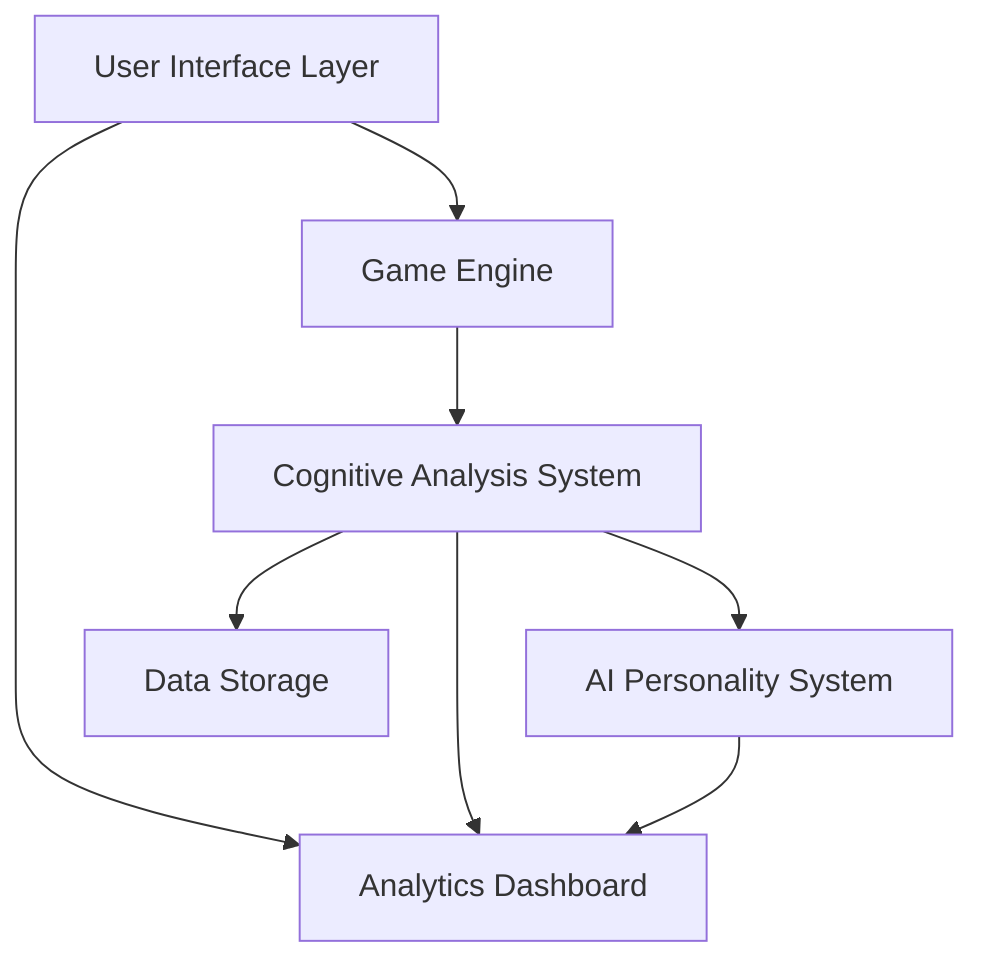

# Design Document: Memory Palace Breakout

## Overview

Memory Palace Breakout is an innovative AI-enhanced Breakout game that combines classic arcade gameplay with real-time cognitive analysis. The system analyzes players' motor control patterns, reaction times, and decision-making processes to build comprehensive cognitive profiles. The architecture consists of four main components: the Game Engine for core gameplay, the Cognitive Analysis System for pattern recognition, the AI Personality System for interactive feedback, and the Analytics Dashboard for data visualization.

## Architecture

The system follows a modular architecture with clear separation of concerns:



### Core Architecture Principles

- **Real-time Processing**: All cognitive analysis occurs in real-time during gameplay
- **Modular Design**: Each system component operates independently with well-defined interfaces
- **Data-Driven AI**: AI personality and analysis adapt based on collected gameplay data
- **Performance Optimization**: Maintains 60fps gameplay while performing complex analysis
- **Browser Compatibility**: Pure JavaScript implementation without external dependencies

## Components and Interfaces

### Game Engine

The Game Engine manages core Breakout mechanics and rendering:

**Core Classes:**
- `GameEngine`: Main game loop and state management
- `Paddle`: Player-controlled paddle with mouse input handling
- `Ball`: Physics simulation for ball movement and collision detection
- `Brick`: Individual brick objects with destruction logic
- `Level`: Level progression and difficulty scaling

**Key Interfaces:**
```javascript
interface GameState {
  score: number;
  level: number;
  lives: number;
  gameActive: boolean;
  bricks: Brick[];
  ball: Ball;
  paddle: Paddle;
}

interface CollisionEvent {
  type: 'paddle' | 'brick' | 'wall';
  position: {x: number, y: number};
  timestamp: number;
  angle: number;
}
```

### Cognitive Analysis System

The Cognitive Analysis System processes gameplay data to extract cognitive patterns:

**Core Classes:**
- `MotorControlTracker`: Records and analyzes mouse movements
- `CognitiveProfiler`: Calculates cognitive metrics and patterns
- `MemoryPalaceSystem`: Builds and maintains cognitive profiles
- `PatternRecognizer`: Identifies gameplay patterns and techniques

**Key Interfaces:**
```javascript
interface MotorControlData {
  mousePositions: {x: number, y: number, timestamp: number}[];
  reactionTimes: number[];
  precisionScores: number[];
  movementFrequency: number;
}

interface CognitiveProfile {
  reactionSpeed: number; // 0-100
  precision: number; // 0-100
  anticipation: number; // 0-100
  consistency: number; // 0-100
  learningRate: number; // 0-100
}
```

### AI Personality System

The AI Personality System provides dynamic, contextual feedback:

**Core Classes:**
- `AIPersonality`: Main AI avatar with mood and response systems
- `ThoughtGenerator`: Creates contextual thoughts and observations
- `MoodTracker`: Manages AI emotional responses to gameplay
- `FeedbackEngine`: Generates personalized insights and encouragement

**Key Interfaces:**
```javascript
interface AIState {
  mood: 'curious' | 'impressed' | 'encouraging' | 'analytical';
  currentThought: string;
  observationLevel: number;
  personalityTraits: string[];
}

interface Observation {
  type: 'skill' | 'pattern' | 'improvement' | 'technique';
  message: string;
  confidence: number;
  timestamp: number;
}
```

### Analytics Dashboard

The Analytics Dashboard visualizes cognitive data and performance metrics:

**Core Classes:**
- `MetricsDisplay`: Real-time metric visualization
- `ProgressBars`: Cognitive skill progress indicators
- `PerformanceCharts`: Historical performance tracking
- `ReportGenerator`: Comprehensive cognitive report creation

## Data Models

### Gameplay Data Model

```javascript
class GameplaySession {
  sessionId: string;
  startTime: Date;
  endTime: Date;
  totalScore: number;
  levelsCompleted: number;
  motorControlData: MotorControlData;
  cognitiveMetrics: CognitiveProfile;
  aiObservations: Observation[];
}
```

### Cognitive Pattern Model

```javascript
class CognitivePattern {
  patternId: string;
  type: 'reaction' | 'precision' | 'anticipation' | 'learning';
  strength: number; // 0-1
  frequency: number;
  firstDetected: Date;
  lastSeen: Date;
  examples: PatternExample[];
}
```

### Memory Palace Model

```javascript
class MemoryPalace {
  playerId: string;
  createdDate: Date;
  lastUpdated: Date;
  cognitiveProfile: CognitiveProfile;
  patterns: CognitivePattern[];
  sessions: GameplaySession[];
  insights: string[];
}
```

## Correctness Properties

*A property is a characteristic or behavior that should hold true across all valid executions of a system-essentially, a formal statement about what the system should do. Properties serve as the bridge between human-readable specifications and machine-verifiable correctness guarantees.*

### Property Reflection

After analyzing all acceptance criteria, several properties can be consolidated:
- Mouse movement tracking and paddle response can be combined into one comprehensive input-output property
- Various cognitive analysis properties (reaction time, precision, pattern detection) can be grouped as they all involve data collection and analysis
- Visual and audio feedback properties can be combined as they both involve sensory output
- Data storage and retrieval properties can be unified as they test data persistence integrity

### Core Game Properties

**Property 1: Mouse-Paddle Synchronization**
*For any* mouse position within the game canvas, the paddle position should correspond accurately to the horizontal mouse coordinate
**Validates: Requirements 1.1**

**Property 2: Ball-Paddle Physics Consistency**
*For any* ball collision with the paddle, the reflection angle should be determined by the contact position on the paddle surface
**Validates: Requirements 1.2**

**Property 3: Brick Destruction and Scoring**
*For any* ball collision with a brick, the brick should be destroyed and the appropriate points should be awarded
**Validates: Requirements 1.3**

**Property 4: Life Management**
*For any* ball position below the paddle, the game should reduce lives by one and reset the ball to starting position
**Validates: Requirements 1.5**

### Cognitive Analysis Properties

**Property 5: Motor Control Data Collection**
*For any* mouse movement during gameplay, the Motor_Control_Tracker should record position, timing, and movement data
**Validates: Requirements 2.1**

**Property 6: Reaction Time Measurement**
*For any* ball approach to the paddle, the Cognitive_Profiler should measure and record reaction time and response accuracy
**Validates: Requirements 2.2**

**Property 7: Precision Score Calculation**
*For any* paddle contact with the ball, the Cognitive_Profiler should calculate and record precision scores based on contact accuracy
**Validates: Requirements 2.3**

**Property 8: Cognitive Profile Building**
*For any* detected gameplay pattern, the Memory_Palace_System should update the cognitive profile with relevant insights
**Validates: Requirements 2.4**

**Property 9: Real-time Metrics Display**
*For any* active gameplay state, the Analytics_Dashboard should display current cognitive metrics and analysis
**Validates: Requirements 2.5**

### AI Personality Properties

**Property 10: Pattern-Based AI Response**
*For any* detected cognitive pattern, the AI_Personality should generate relevant thoughts and observations
**Validates: Requirements 3.1**

**Property 11: Performance-Adaptive Mood**
*For any* significant performance change, the AI_Personality should adapt its mood and response style accordingly
**Validates: Requirements 3.2**

**Property 12: Technique Recognition**
*For any* advanced gameplay technique, the AI_Personality should recognize and provide appropriate commentary
**Validates: Requirements 3.3**

### Analytics and Performance Properties

**Property 13: Movement Analysis**
*For any* paddle movement, the Motor_Control_Tracker should calculate movement frequency and accuracy metrics
**Validates: Requirements 4.1**

**Property 14: Response Measurement**
*For any* player reaction, the Cognitive_Profiler should measure response latency and positioning precision
**Validates: Requirements 4.2**

**Property 15: Technique Detection**
*For any* trick shot or advanced technique, the Analytics_Dashboard should detect and record the technique
**Validates: Requirements 4.3**

**Property 16: Progress Visualization**
*For any* active gameplay, the Analytics_Dashboard should display updated progress bars for cognitive skills
**Validates: Requirements 4.5**

### Visual and Audio Properties

**Property 17: Visual Effects Rendering**
*For any* game render cycle, the Game_Engine should display neon glow effects and retro styling elements
**Validates: Requirements 5.1**

**Property 18: Audio Feedback**
*For any* collision event, the Game_Engine should play the appropriate sound effect
**Validates: Requirements 5.2**

**Property 19: Destruction Effects**
*For any* brick destruction, the Game_Engine should display visual destruction effects
**Validates: Requirements 5.3**

**Property 20: Performance Maintenance**
*For any* gameplay session, the Game_Engine should maintain 60fps performance while rendering visual effects
**Validates: Requirements 5.5**

### Data Persistence Properties

**Property 21: Data Storage Integrity**
*For any* collected cognitive data, the Memory_Palace_System should store motor control patterns without data loss
**Validates: Requirements 6.1**

**Property 22: Profile Update Consistency**
*For any* completed session, the Memory_Palace_System should update cumulative cognitive profiles accurately
**Validates: Requirements 6.2**

**Property 23: Report Generation**
*For any* analysis request, the Cognitive_Profiler should generate detailed reports from stored data
**Validates: Requirements 6.3**

**Property 24: Pattern Organization**
*For any* identified pattern, the Memory_Palace_System should categorize and organize cognitive insights appropriately
**Validates: Requirements 6.4**

**Property 25: Data Processing Integrity**
*For any* data processing operation, the Memory_Palace_System should maintain data integrity and accuracy
**Validates: Requirements 6.5**

### Interface and Compatibility Properties

**Property 26: Button Response**
*For any* interface button click, the Game_Engine should respond with the appropriate game state change
**Validates: Requirements 7.2**

**Property 27: Pause State Management**
*For any* pause/resume cycle, the Game_Engine should maintain current state and allow proper resumption
**Validates: Requirements 7.4**

**Property 28: Cross-Browser Initialization**
*For any* modern browser, the Game_Engine should initialize without external dependencies
**Validates: Requirements 8.1**

**Property 29: Performance Consistency**
*For any* browser environment, the Game_Engine should maintain consistent rendering performance
**Validates: Requirements 8.2**

**Property 30: Mouse Event Reliability**
*For any* desktop system, the Motor_Control_Tracker should reliably capture and process mouse events
**Validates: Requirements 8.3**

**Property 31: Audio API Usage**
*For any* audio playback, the Game_Engine should use Web Audio API for cross-browser compatibility
**Validates: Requirements 8.4**

**Property 32: Memory Optimization**
*For any* extended gameplay session, the Game_Engine should optimize memory usage and prevent performance degradation
**Validates: Requirements 8.5**

## Error Handling

### Game Engine Error Handling

- **Canvas Initialization Failure**: Graceful fallback with error message if Canvas API unavailable
- **Audio Context Failure**: Silent fallback if Web Audio API unavailable
- **Mouse Event Failure**: Keyboard fallback controls if mouse events fail
- **Performance Degradation**: Automatic quality reduction if frame rate drops below 30fps

### Cognitive Analysis Error Handling

- **Data Collection Failure**: Continue gameplay with reduced analysis if tracking fails
- **Pattern Recognition Failure**: Graceful degradation with basic metrics if advanced analysis fails
- **Storage Failure**: In-memory fallback if local storage unavailable
- **Analysis Timeout**: Partial results if analysis takes too long

### AI Personality Error Handling

- **Thought Generation Failure**: Default encouraging messages if AI response generation fails
- **Mood Tracking Failure**: Neutral personality state if mood analysis fails
- **Observation Failure**: Basic gameplay feedback if advanced observations fail

## Testing Strategy

### Dual Testing Approach

The testing strategy employs both unit testing and property-based testing to ensure comprehensive coverage:

**Unit Tests**: Verify specific examples, edge cases, and error conditions
- Test specific collision scenarios and edge cases
- Verify UI component behavior with known inputs
- Test error handling with invalid data
- Validate integration points between components

**Property-Based Tests**: Verify universal properties across all inputs
- Test game physics with randomized ball and paddle positions
- Verify cognitive analysis with varied mouse movement patterns
- Test AI responses with diverse gameplay scenarios
- Validate data persistence with random cognitive profiles

### Property-Based Testing Configuration

- **Testing Framework**: Use fast-check for JavaScript property-based testing
- **Test Iterations**: Minimum 100 iterations per property test
- **Test Tagging**: Each property test tagged with format: **Feature: memory-palace-breakout, Property {number}: {property_text}**
- **Coverage**: Each correctness property implemented as a single property-based test
- **Integration**: Property tests run alongside unit tests in continuous integration

### Testing Implementation

**Game Engine Testing**:
- Property tests for physics calculations with randomized inputs
- Unit tests for specific collision scenarios and boundary conditions
- Performance tests for frame rate maintenance under load
- Cross-browser compatibility tests for rendering consistency

**Cognitive Analysis Testing**:
- Property tests for data collection accuracy with varied input patterns
- Unit tests for specific cognitive metric calculations
- Integration tests for data flow between analysis components
- Stress tests for real-time processing performance

**AI Personality Testing**:
- Property tests for response generation with diverse gameplay patterns
- Unit tests for specific mood transitions and thought generation
- Integration tests for AI-player interaction scenarios
- Usability tests for feedback quality and relevance

**Data Persistence Testing**:
- Property tests for data integrity across storage operations
- Unit tests for specific data serialization and retrieval scenarios
- Integration tests for cross-session data continuity
- Recovery tests for data corruption and storage failure scenarios